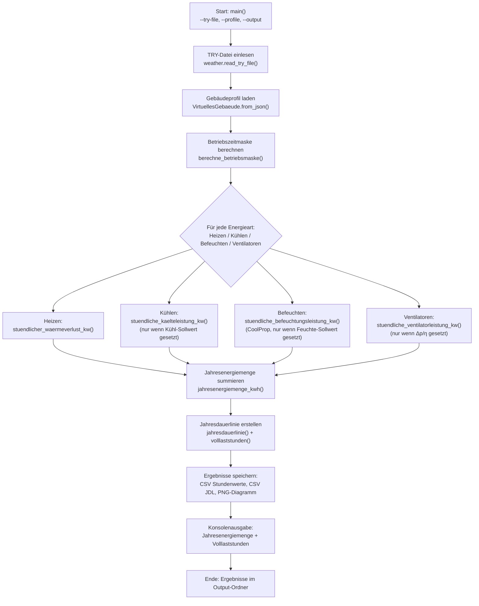

```mermaid
flowchart TD
    A["Start: main()\n--try-file, --profile, --output"] --> B["TRY-Datei einlesen\nweather.read_try_file()"]
    B --> C["Gebäudeprofil laden\nVirtuellesGebaeude.from_json()"]
    C --> D["Betriebszeitmaske berechnen\nberechne_betriebsmaske()"]
    D --> E{"Für jede Energieart:\nHeizen / Kühlen / Befeuchten / Ventilatoren"}

    E --> F1["Heizen:\nstuendlicher_waermeverlust_kw()"]
    E --> F2["Kühlen:\nstuendliche_kaelteleistung_kw()\n(nur wenn Kühl-Sollwert gesetzt)"]
    E --> F3["Befeuchten:\nstuendliche_befeuchtungsleistung_kw()\n(CoolProp, nur wenn Feuchte-Sollwert gesetzt)"]
    E --> F4["Ventilatoren:\nstuendliche_ventilatorleistung_kw()\n(nur wenn Δp/η gesetzt)"]

    F1 --> G["Jahresenergiemenge summieren\njahresenergiemenge_kwh()"]
    F2 --> G
    F3 --> G
    F4 --> G

    G --> H["Jahresdauerlinie erstellen\njahresdauerlinie() + volllaststunden()"]
    H --> I["Ergebnisse speichern:\nCSV Stundenwerte, CSV JDL, PNG-Diagramm"]
    I --> J["Konsolenausgabe:\nJahresenergiemenge + Volllaststunden"]
    J --> K["Ende: Ergebnisse im Output-Ordner"]
```
